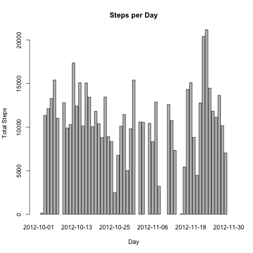
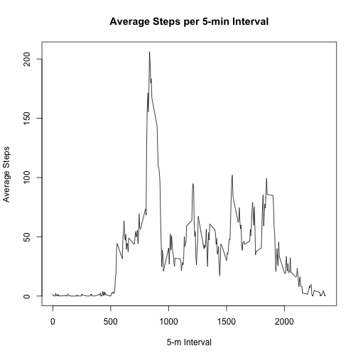
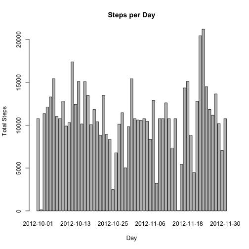

# Reproducible Research: Peer Assessment 1


## Loading and preprocessing the data

```
## 'data.frame':	17568 obs. of  3 variables:
##  $ steps   : int  NA NA NA NA NA NA NA NA NA NA ...
##  $ date    : chr  "2012-10-01" "2012-10-01" "2012-10-01" "2012-10-01" ...
##  $ interval: int  0 5 10 15 20 25 30 35 40 45 ...
```

```
##      steps           date              interval   
##  Min.   :  0.0   Length:17568       Min.   :   0  
##  1st Qu.:  0.0   Class :character   1st Qu.: 589  
##  Median :  0.0   Mode  :character   Median :1178  
##  Mean   : 37.4                      Mean   :1178  
##  3rd Qu.: 12.0                      3rd Qu.:1766  
##  Max.   :806.0                      Max.   :2355  
##  NA's   :2304
```


## What is mean total number of steps taken per day?
 

```
## The maximum number of steps, 21194, occurred on 2012-11-23
## Mean: 10766
## Median: 10765
```


## What is the average daily activity pattern?
 

```
## The maximum average number of steps, 206, occurred on interval 835 (i.e. 08:35)
```


## Imputing missing values
### My technique for imputing assumes that the missing value at a given interval will be replaced with the average value at that same interval.

```
## The steps column has 2304 entries with missing data (i.e. NA values)
```

```
##   interval avg_steps
## 1        0   1.71698
## 2        5   0.33962
## 3       10   0.13208
## 4       15   0.15094
## 5       20   0.07547
## 6       25   2.09434
```

 

```
## Mean: 10766
## Median: 10766
```


## Are there differences in activity patterns between weekdays and weekends?


